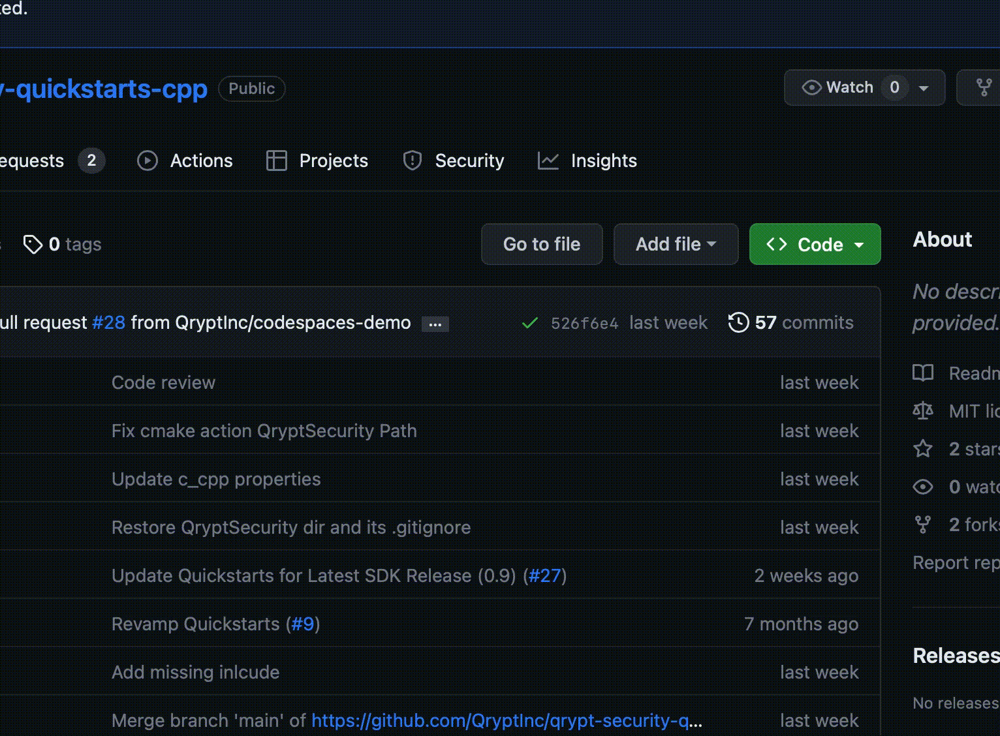
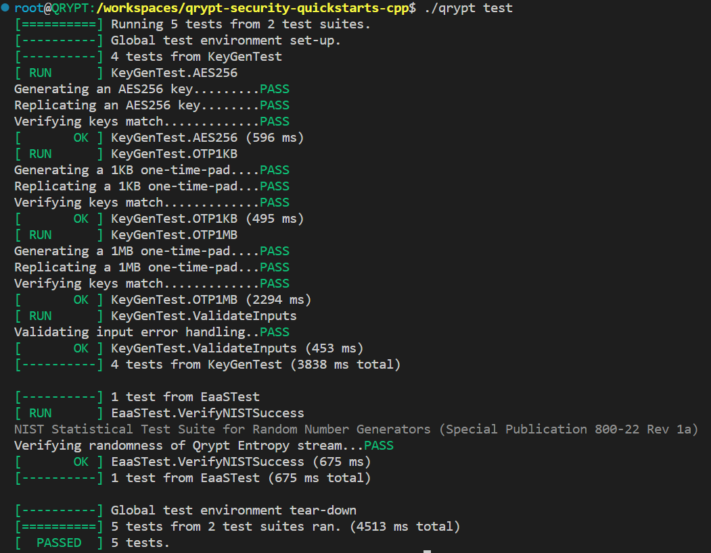

# Qrypt SDK Quickstart
This program demonstrates how to use the QryptSecurity SDK to securely and independently generate keys or cryptographic one-time-pads on separate devices. The SDK works by assembling a key using samples taken from Qrypt servers and outputting a non-cryptographic metadata file that contains the information needed to reassemble the same key on another system at another time.

The process of creating a new key using the SDK is called `generate`.

The process of reassembling a key from existing metadata is called `replicate`.

The QryptSecurity SDK contains cryptographic functionality that may be [export controlled](https://www.qrypt.com/terms). By using this software, any user acknowledges that they have reviewed and agreed to the [terms of use and privacy policy](https://www.qrypt.com/terms), to the extent permissible by applicable law.

### Contents
1. [Quickstart using Github Codespaces](#quickstart-using-github-codespaces)
1. [Building this quickstart manually](#building-this-quickstart-manually)
1. [Multi-device demonstration using Docker-Compose](#multi-device-demonstration-using-docker-compose)

## Quickstart using Github Codespaces

To start this quickstart in a github codespace for easy online setup, create the codespace from the `<> Code` dropdown on github.

Once started, the devcontainer will automatically build the `qrypt` executable and you can start creating distributed one-time-pads right away!

Run `./qrypt generate` to output a key and save `meta.dat`, instructions for replicating that same key at a later time.

Run `./qrypt replicate` to read `meta.dat` and use it to generate and output the same key.

Use the `--help` option on the `qrypt` executable and its submenus for more information on available operations and their optional arguments.

The `files` subdirectory contains sample files and images for demonstrating encryption using keys generated with distributed keygen. See `./qrypt encrypt --help` and `./qrypt decrypt --help` for more information about the demo tool's encryption capabilities.

If at any time the demo's default API token becomes invalid, you may generate a new personal token at `https://portal.qrypt.com` to continue generating keys.

## Building this quickstart manually
The QryptSecurity SDK is intended to be run on an Ubuntu 20.04 system. The following commands assume a system configured with OpenSSL, CMake, and g++.

1. [Create a Qrypt account for free](https://portal.qrypt.com/register).
1. On the Qrypt portal, download the Qrypt SDK from "Products > Qrypt SDK" and save the .tgz to the project root.
1. (Optional) On the Qrypt portal, register a personal access token for keygen.
1. `tar -zxvf qrypt-security-0.9.4-ubuntu.tgz --strip-components=1 -C QryptSecurity`
1. `cmake . -B build`
1. `cmake --build build`
1. `./qrypt --help`

If googletest is installed on your system, you may add `-DBUILD_TESTS=ON` to your cmake command to enable an automated
validation suite which can be run with `./qrypt test`:


## Multi-device demonstration using Docker-Compose
The `compose` subdirectory contains a docker-compose.yml and sample scripts for simulating true distributed keygen on two separate systems.

1. On the [Qrypt portal](https://portal.qrypt.com/register), register a free account and create a personal access token for keygen.
1. Export the token to your environment: `export QRYPT_TOKEN="eyJhbGciOiJ......"`
1. Bring up the "Alice" and "Bob" demonstration containers:
    ```
    git clone https://github.com/QryptInc/qrypt-security-quickstarts-cpp.git
    cd qrypt-security-quickstarts-cpp/compose
    QRYPT_TOKEN=$QRYPT_TOKEN docker-compose up -d
    ```
1. Enter the "Alice" container, generate a key, encrypt the sample text, and transfer the ciphertext + metadata to "Bob":
    ```
    # Enter Alice's container
    docker exec -it alice_container bash
    ```
    ```
    # OTP generation and encryption
    qrypt generate --token=$QRYPT_TOKEN --key-len=$(stat -c%s /workspace/files/sample.txt) --key-filename=key.dat
    qrypt encrypt --input-filename=/workspace/files/sample.txt --key-filename=key.dat --output-filename=ciphertext.dat
    ```
    ```
    # Send the OTP metadata and encrypted files to Bob
    sshpass -p "ubuntu" scp -o 'StrictHostKeyChecking no' meta.dat ciphertext.dat ubuntu@bob:/home/ubuntu
    ```
1. Enter the "Bob" container, replicate the key, decrypt the ciphertext, and compare the result with the original sample text:
    ```
    # Enter Bob's container
    docker exec -it bob_container bash
    ```
    ```
    # OTP replication and decryption
    qrypt replicate --token=$QRYPT_TOKEN --key-len=$(stat -c%s ciphertext.dat) --key-filename=key.dat
    qrypt encrypt --input-filename=ciphertext.dat --key-filename=key.dat --output-filename=decrypted.txt
    ```
    ```
    # Verify the OTP decrypted files
    cmp /workspace/files/sample.txt decrypted.txt
    ```
