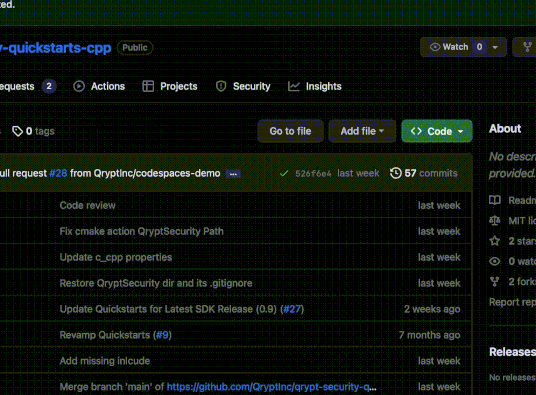

# Qrypt SDK Test Envrionment
This template can be used to create an environment with resources in place to test and validate Qrypt's SDK.

## Quickstart
### 1. Create the codespace
Click the `<> Code` dropdown on github and select `Create codespace on main`. This will create a new codespace, which is a sandboxed devcontainer with everything you need to experiement with the Qrypt SDK.

### 2. Execute validation tests
We've taken the Qrypt SDK and integrated it into a CLI with some basic functionality. After the envrionment loads it will automatically build the CLI. Wait until you see `[100%] Built target qrypt`, indicating that the CLI build is complete, and then run `./qrypt test` to validate:
- Qrypt can be used to securely generate an AES key
- Qrypt can be used to securely generate a 1KB one-time-pad
- Qrypt can be used to securely generate a 1MB one-time-pad
- Qrypts quantum generated random passes [NIST 800-22](https://csrc.nist.gov/publications/detail/sp/800-22/rev-1a/final) Statistical Tests for Random Number Generators

## More advanced CLI usage
### Help menu
Use the `--help` option on the `qrypt` executable and its submenus for more information on available operations and their optional arguments.
 Ex: `./qrypt --help`
 Ex: `./qrypt generate --help`

### Generate
Run `./qrypt generate` to generate a key and save instructions to `./meta.dat`

### Replicate
Run `./qrypt replicate` to read `./meta.dat` and use it to generate and output the same key.

### Encrypt
TBD

### Decrypt
TBD

## Additional resources
- [Building the quickstart locally](./docs/QUICKSTART-BUILD.md)
- [Multi-device demonstration using Docker-Compose](./docs/MULTIDEVICE-DEMO.md)

## Terms of Use
_The QryptSecurity SDK contains cryptographic functionality that may be [export controlled](https://www.qrypt.com/terms). By using this software, any user acknowledges that they have reviewed and agreed to the [terms of use and privacy policy](https://www.qrypt.com/terms), to the extent permissible by applicable law._