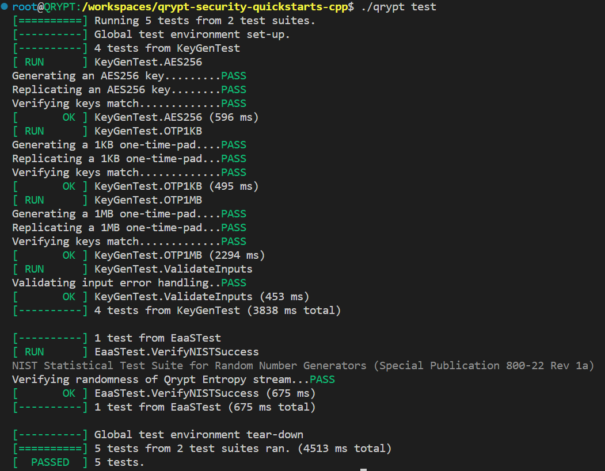

## Building this quickstart manually
The QryptSecurity SDK is intended to be run on an Ubuntu 22.04 system with an amd64 architecture, either natively or using an emulated platform. 

### Docker Container Build
A standardized Dockerfile is provided in `./devcontainer` that installs dependencies and builds the quickstarts.

If a VSCode editor is being used, the containerized environment can be created using the "Dev Containers" extension.

Without VSCode, create the Docker container manually:
1. `docker image build -t qrypt-quickstarts ./.devcontainer`
1. `docker container run -d --name qrypt-quickstarts qrypt-quickstarts tail -f /dev/null`
1. `docker exec -it qrypt-quickstarts /bin/bash`
1. `git clone https://github.com/QryptInc/qrypt-security-quickstarts-cpp.git`
1. `cd qrypt-security-quickstarts-cpp`
1. `./.devcontainer/setup.sh`
1. `./qrypt --help`

### Manual Build
The following commands assume an Ubuntu 22.04 system with an amd64 architecture configured with OpenSSL, CURL, CMake, and g++.

Prerequisites: 
1. Install the recommended packages: `apt-get -y install git cmake gcc g++ xxd libssl-dev libgtest-dev libcurl4-openssl-dev openssh-server ufw sshpass curl jq`
2. Clone the quickstarts repo.

Steps:
1. [Create a Qrypt account for free](https://portal.qrypt.com/register).
1. On the Qrypt portal, download the Qrypt SDK from "Products > Qrypt SDK" and save the .tgz to the repository root.
1. (Optional) On the Qrypt portal, register a personal access token for keygen.
1. `tar -zxvf qrypt-security-0.11.22-ubuntu.tgz --strip-components=1 -C QryptSecurity`
1. `cmake . -B build`
1. `cmake --build build`
1. `./qrypt --help`

### Testing
If googletest is installed on your system, you may add `-DENABLE_TESTS=ON` to your cmake command to enable an automated validation suite which can be run with `./qrypt test`:
1. `cmake -B build -DCMAKE_BUILD_TYPE=Release -DENABLE_TESTS=ON`
2. `cmake --build build --config Release`

